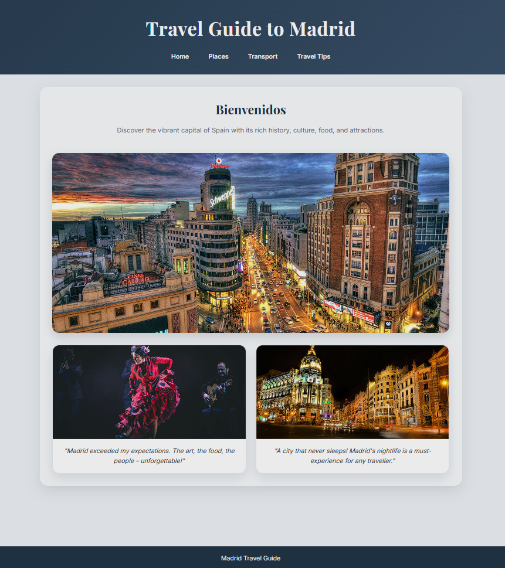

# 🇪🇸 Madrid Travel Guide

A responsive travel website created as part of a university web development module. The project provides visitors with information about attractions, transport options, and travel tips for Madrid.

## 🌐 Live Demo

[View Website](https://messtiso.github.io/madrid-travel-guide/)

---

## ✨ Features

* Multi-page website
* Modern responsive design
* Tourist attractions and visitor information
* Transport guidance
* Travel tips for visitors
* Mobile-friendly layout

---

## 🛠️ Technologies Used

* HTML5
* CSS3

---

## 📸 Preview

---

## 📚 What I Learned

Through this project I practiced:

* Semantic HTML structure
* Responsive CSS layouts
* Navigation between multiple pages
* Website design and organisation
* Publishing projects with GitHub Pages

---

## 🚀 Future Improvements

* Interactive maps
* Search functionality
* Additional destinations
* Booking and itinerary features

---

## 👨‍💻 Author

**Sebastian Restrepo**

BSc Computing Student
Birkbeck, University of London

